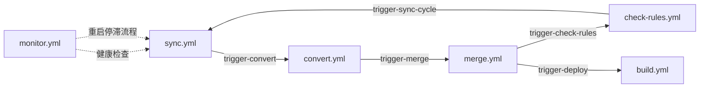

# GitHub Actions 工作流循环机制

## 概述

本项目使用了一个精心设计的工作流循环系统，确保规则的同步、转换、合并和验证能够自动且不间断地运行。

## 工作流循环结构

## 工作流详情

### 1. sync.yml (同步规则)

- **触发方式**：
  - 定时：每小时第 5 分钟
  - repository_dispatch: `trigger-sync-cycle`
  - 手动触发
- **并发控制**：`group: sync-workflow`, 不取消进行中的任务
- **触发下游**：`trigger-convert`

### 2. convert.yml (Loon 转 Surge 模块)

- **触发方式**：
  - repository_dispatch: `trigger-convert`
  - 手动触发
  - ❌ 已移除定时触发
- **并发控制**：`group: convert-workflow`, 不取消进行中的任务
- **触发下游**：`trigger-merge`

### 3. merge.yml (合并模块)

- **触发方式**：
  - repository_dispatch: `trigger-merge`
  - 手动触发
  - ❌ 已移除定时触发
- **并发控制**：`group: merge-workflow`, 不取消进行中的任务
- **触发下游**：
  - `trigger-check-rules`
  - `trigger-deploy` (并行)

### 4. check-rules.yml (验证 IP 规则)

- **触发方式**：
  - repository_dispatch: `trigger-check-rules`
  - 定时：每周三
  - PR 触发
  - 手动触发
- **并发控制**：`group: check-rules-workflow-{pr/ref}`, 不取消进行中的任务
- **触发下游**：`trigger-sync-cycle` (延迟 5 分钟)

### 5. build.yml (构建 Web UI)

- **触发方式**：
  - repository_dispatch: `trigger-deploy`
  - 定时：每天一次
  - Push 触发
  - 手动触发
- **并发控制**：`group: build-workflow-{pr/ref}`, 允许取消
- **超时限制**：30 分钟
- **特点**：并行分支，不影响主循环

### 6. monitor.yml (健康监控)

- **触发方式**：
  - 定时：每 4 小时
  - 手动触发
- **功能**：
  - 检查各工作流运行状态
  - 发现问题时创建 issue
  - 必要时重启工作流循环

## 关键设计特点

1. **串联执行**：主循环中的工作流通过 repository_dispatch 事件串联，确保顺序执行
2. **并发保护**：每个工作流都有独立的并发组，主循环工作流设置`cancel-in-progress: false`
3. **循环机制**：check-rules 完成后触发 sync，形成闭环
4. **健康监控**：monitor 工作流定期检查系统健康状态
5. **错误恢复**：monitor 可以在检测到问题时重启循环
6. **并行分支**：build 工作流作为并行分支，不阻塞主循环

## 运行频率

- **主循环**：约每小时运行一次（由 sync 的 cron 触发）
- **循环延迟**：check-rules 完成后等待 5 分钟再触发下一轮
- **健康检查**：每 4 小时一次
- **构建部署**：每天一次 + 主循环触发

## 故障处理

1. 单个工作流失败不会中断整个循环
2. monitor 工作流会检测停滞并尝试重启
3. 所有关键步骤都有`continue-on-error`保护
4. 并发控制确保不会有重复执行

## 手动干预

- 每个工作流都支持`workflow_dispatch`手动触发
- 可以通过 monitor 工作流手动检查健康状态
- 可以手动触发`trigger-sync-cycle`重启循环
